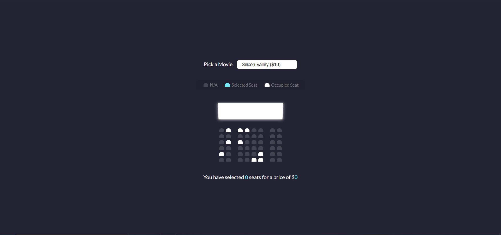

# Movie_seat_booking

A simple web application based on Theater scenario, used by general HTML CSS and JavaScript

 

 

User are allowed to select any seat which is not occupied, the simple application could sum the total price for user, based on the number of selected seats and movie.

